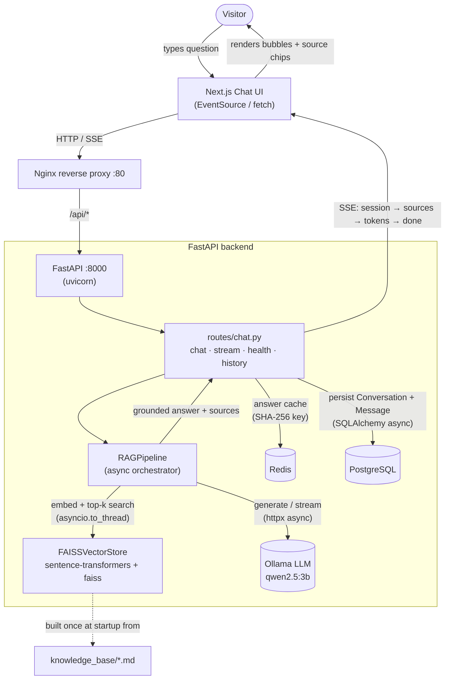
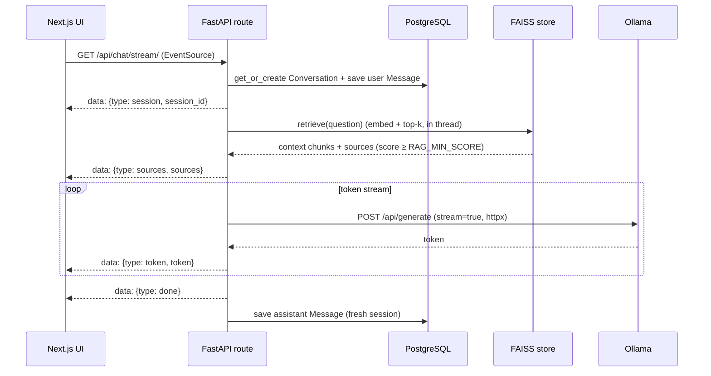

# More3zdenAI — Architecture & Flow

The backend is a **FastAPI** (async) RAG service. A Next.js UI streams answers
over Server-Sent Events; FastAPI retrieves context from a FAISS index built over
`knowledge_base/*.md` and generates grounded answers with a local **Ollama**
model (`qwen2.5:3b`). PostgreSQL stores conversation history; Redis caches answers.

## System flow

## Streaming request lifecycle

`GET /api/chat/stream/?question=...&session_id=...`

## Non-streaming path

`POST /api/chat/` does the same retrieval + generation synchronously, but first
checks the **Redis cache** (keyed by a normalized SHA-256 of the question). On a
hit it skips Ollama entirely; on a miss it caches the result for `RAG_CACHE_TTL`
seconds. Both turns are persisted to PostgreSQL.

## Key components

| Component | File | Responsibility |
|---|---|---|
| App entrypoint | `backend/app/main.py` | FastAPI app, CORS, lifespan (create schema + warm FAISS) |
| Settings | `backend/app/config.py` | env-driven config (pydantic-settings) |
| Routes | `backend/app/routes/chat.py` | the 4 endpoints, persistence, caching |
| Pipeline | `backend/app/rag/pipeline.py` | async retrieve → generate / stream |
| Vector store | `backend/app/rag/vector_store.py` | embeddings + FAISS (sync, run in threadpool) |
| LLM client | `backend/app/rag/llm_client.py` | async Ollama client (httpx), prompt + system prompt |
| Models | `backend/app/models.py` | `Conversation`, `Message` (SQLAlchemy async) |
| Cache | `backend/app/cache.py` | async Redis answer cache |

## Startup sequence

On boot the app lifespan (1) creates tables via `Base.metadata.create_all`, then
(2) warms the FAISS store — loading the embedding model and the index from
`/app/data/`, or **building it from the knowledge base on first run**. The
container reports healthy on `GET /api/health/` once Ollama is reachable and the
index is loaded.
